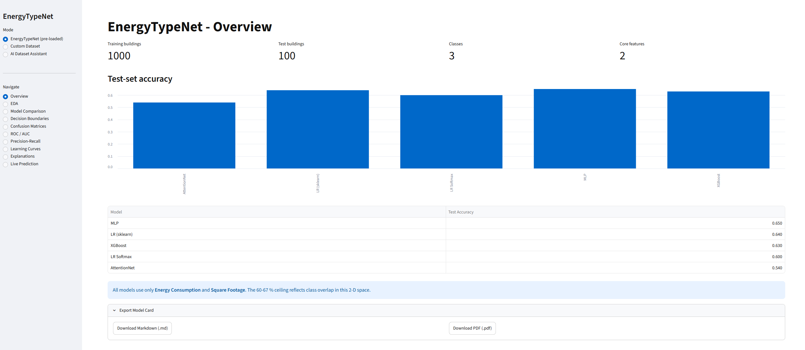
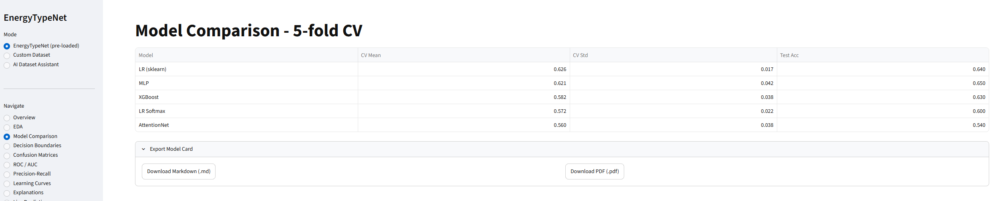
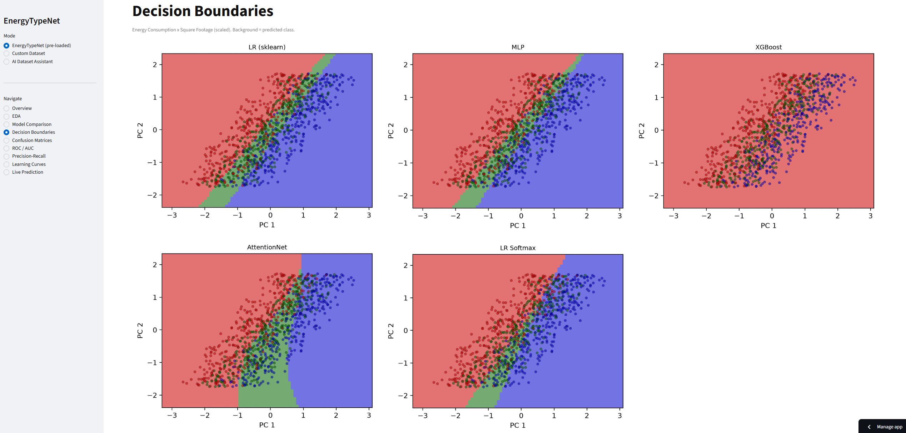
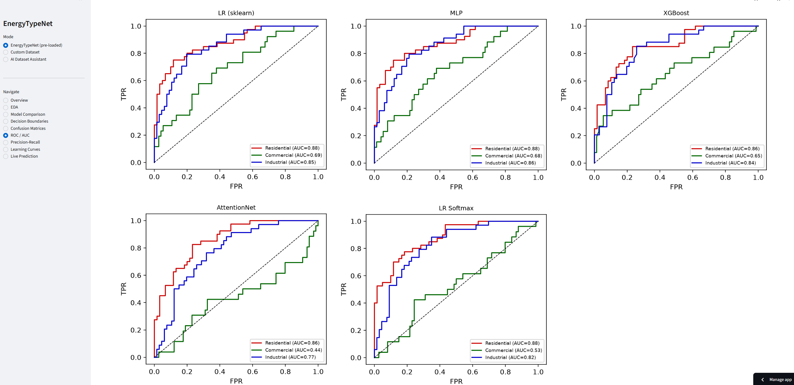
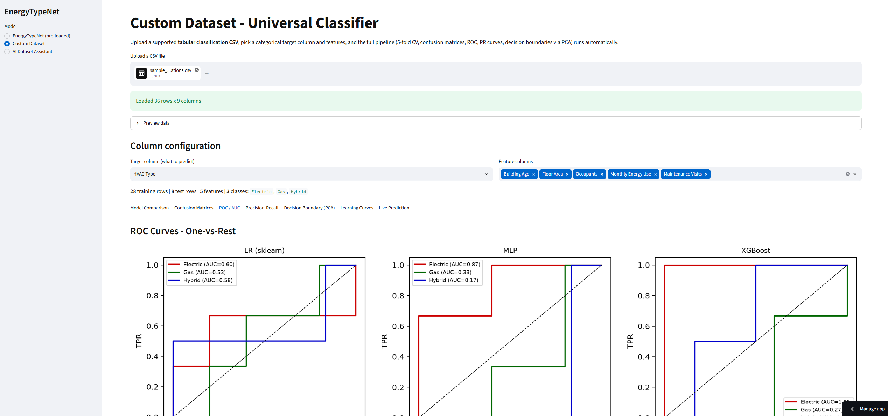
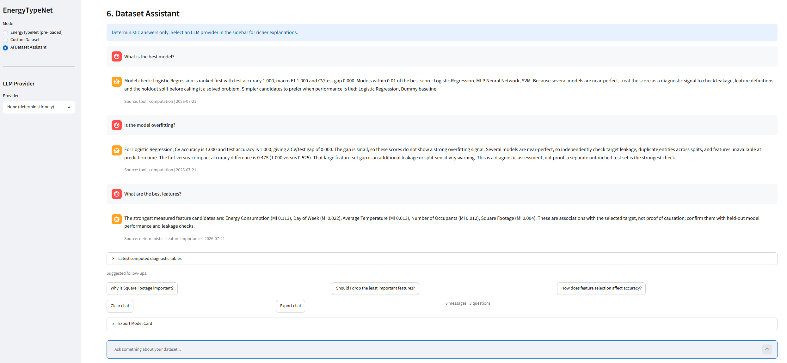
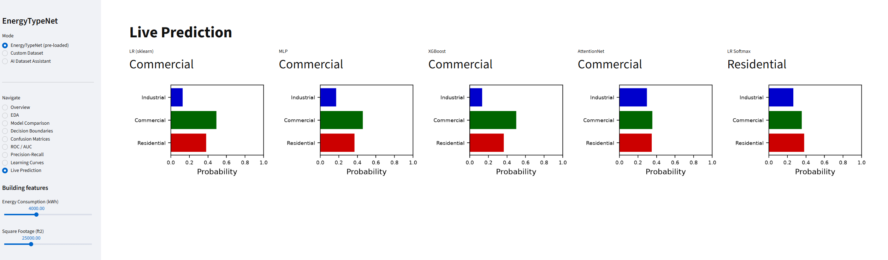

# EnergyTypeNet
[](https://github.com/bartoszbryg/EnergyTypeNet/actions/workflows/ci.yml)
[](https://www.python.org/downloads/release/python-3110/)
[](https://energytypenet-ml.streamlit.app/)
[](LICENSE)

> [Open Live Demo](https://energytypenet-ml.streamlit.app/) — Upload a supported tabular classification CSV for model comparison and visual diagnostics, use the broader AI Dataset Assistant for classification or regression analysis, or explore the bundled EnergyTypeNet demo with interactive decision boundaries, ROC curves and grounded dataset Q&A.

I built EnergyTypeNet to predict whether a building is Residential, Commercial or Industrial from energy-consumption and building-attribute data. The core idea was to go beyond simply applying sklearn models and implement several algorithms from scratch so I could understand what is happening inside the learning process. I originally built three custom NumPy classifiers: an attention-weighted nearest-neighbor classifier using exponential kernel weighting, a One-vs-Rest logistic regression trained with gradient descent and L2 regularization, and a multiclass Softmax regression with a joint weight matrix and categorical cross-entropy loss. I later extended this into a broader advanced model suite with custom decision trees, SVM, Naive Bayes variants, Bayesian linear regression, regularized regression, dimensionality reduction, unsupervised clustering, custom Bagging and AdaBoost ensembles, a custom multi-layer perceptron trained with backpropagation and a PyTorch tabular deep-learning workflow. The project now covers Ridge, Lasso, ElasticNet, regularized logistic regression, PCA, LDA, Kernel PCA, t-SNE, optional UMAP, K-Means, DBSCAN, Gaussian Mixture Models, agglomerative hierarchical clustering, ensemble diversity diagnostics, Bagging, AdaBoost, Extra Trees, histogram gradient boosting, neural-network activation functions, initialization, optimizers, dropout, early stopping, MLP classification/regression, PyTorch `nn.Module` training loops, autoencoder-based reconstruction/anomaly detection, convolutional neural-network foundations on image data and recurrent neural-network foundations for sequential data.

On top of those custom models, I trained sklearn Logistic Regression, MLP and XGBoost baselines, then compared the full model set with 5-fold stratified cross-validation, holdout evaluation, confusion matrices, ROC/AUC curves, precision-recall curves and learning curves. I also added soft-voting, stacking, custom Bagging, custom AdaBoost, Extra Trees and HistGradientBoosting experiments to test when combining learners improves performance over a single model. The project is packaged like a real machine-learning system: it includes MLflow experiment tracking, a reproducible training script, saved model artifacts, a FastAPI prediction service, Docker deployment support, GitHub Actions CI and a Streamlit dashboard.

The project also grew into a reusable AutoML-style tool through the AI Dataset Assistant. Instead of working only on the original building-energy dataset, the dashboard can now accept a custom CSV file, profile the dataset, detect missing values and data types, suggest possible target columns, infer whether the task should be classification or regression, recommend usable feature columns, rank features with mutual information, compare all selected features against a compact feature set, train multiple baseline models and generate a short natural-language dataset report grounded in computed results. It also has a multi-turn dataset chat assistant with deterministic grounded answers, context-aware follow-up routing, safe diagnostic computation tools, suggested questions, JSON chat export and optional local or hosted LLM streaming, so the explanations can feel more natural while still staying tied to actual model outputs.

The research part answers a specific question I had: is the accuracy ceiling caused by too little data, or by the classes being too similar in feature space? Notebook 06 runs a synthetic experiment showing that the issue is not caused by insufficient data, so collecting more data would not fix it. One important finding was that the extended feature set can produce near-perfect validation scores, but that is not necessarily a better scientific result because some features may encode the label too directly. The more honest benchmark is the smaller core-feature setup, where performance is lower but more realistic.

## Screenshots

| Overview | Model Comparison |
| --- | --- |
|  |  |

| Decision Boundaries | ROC Curves |
| --- | --- |
|  |  |

| Custom Dataset Analysis | Chat Assistant |
| --- | --- |
|  |  |

| Live Prediction |
| --- |
|  |

*These screenshots show the deployed Streamlit app. See [`screenshots/README.md`](screenshots/README.md) for the recapture checklist.*

---

## Main Capabilities

- Predict building type from energy-consumption and building-attribute data.
- Compare custom classifiers against sklearn, neural-network and XGBoost baselines.
- Train soft-voting and stacking ensembles.
- Study Bagging, AdaBoost, Extra Trees, HistGradientBoosting, ensemble diversity and error-correlation diagnostics.
- Run feature engineering, feature selection, decision-boundary and model-diagnostic notebooks.
- Study regularization with Ridge, Lasso, ElasticNet and regularized logistic regression experiments.
- Study dimensionality reduction with custom PCA, LDA, Kernel PCA, t-SNE and optional UMAP experiments.
- Study unsupervised clustering with custom K-Means, DBSCAN, Gaussian Mixture Models and agglomerative clustering.
- Study neural networks from scratch with custom NumPy backpropagation, optimizers, dropout and early stopping.
- Study PyTorch tabular deep learning with tensors, autograd, `nn.Module`, `Dataset` / `DataLoader`, optimizers, schedulers, regularization and model saving.
- Use PyTorch autoencoders for tabular compression, denoising, latent-space visualization and anomaly scoring based on reconstruction error.
- Study convolutional neural networks with PyTorch using image data where local spatial structure is meaningful.
- Study recurrent neural networks with NumPy RNN cells, PyTorch RNN/LSTM/GRU models, sequence generation and sequence classification.
- Train and serialize the best model with `joblib`.
- Serve predictions through a FastAPI endpoint.
- Explore results through a Streamlit dashboard.
- Upload custom CSV files and run a lightweight AutoML workflow.
- Generate dataset reports and grounded natural-language explanations.
- Export model cards with dataset details, feature analysis, model diagnostics and selected grounded explanations in Markdown, with optional PDF output when the PDF dependencies are installed.
- Ask multi-turn dataset questions with chat history, suggested follow-ups and JSON export.
- Optionally stream LLM answers with local Ollama or hosted OpenAI/Anthropic providers.

---

## Dataset Background

The Energy Consumption Dataset contains 1,000 training rows and 100 test rows describing buildings with usage, capacity and environmental attributes.

Features included in the original dataset:

- Building Type
- Square Footage
- Number of Occupants
- Appliances Used
- Average Temperature
- Day of Week
- Energy Consumption

The main supervised task in this project is **building-type classification**, where the target is `Building Type`.

Possible additional task formulations:

- Classification: `Building Type`, `Day of Week`
- Regression: `Energy Consumption`, `Appliances Used`, `Average Temperature`, `Square Footage`

This problem is relevant to building management, construction planning, architecture, utility billing and energy-efficiency analysis. The dataset is also useful for discussing model limitations because important real-world factors such as climate, location, insulation, building age, materials and resident behavior are not included.

---

## EnergyTypeNet Models

Custom models implemented from scratch:

| Model                          | Implementation                               | Purpose                                                                     |
| ------------------------------ | -------------------------------------------- | --------------------------------------------------------------------------- |
| `AttentionClassifier`          | NumPy + sklearn-compatible estimator API     | Kernel-weighted nearest-neighbor style classifier                           |
| `LogisticRegressionOvR`        | NumPy                                        | One-vs-Rest logistic regression with gradient descent and L2 regularization |
| `LogisticRegressionSoftmax`    | NumPy                                        | Multiclass softmax regression with cross-entropy loss                       |
| `DecisionTreeClassifierCustom` | NumPy                                        | CART-style classifier with Gini or entropy splits                           |
| `DecisionTreeRegressorCustom`  | NumPy                                        | CART-style regressor using MSE reduction                                    |
| `BaggingClassifierCustom`      | NumPy + sklearn-compatible estimator API     | Bootstrap aggregating with custom base estimators, feature subsampling and out-of-bag scoring |
| `BaggingRegressorCustom`       | NumPy + sklearn-compatible estimator API     | Bootstrap aggregating for regression with averaged predictions and OOB R2   |
| `AdaBoostClassifierCustom`     | NumPy + sklearn-compatible estimator API     | SAMME multi-class boosting with sequential sample reweighting, staged predictions and a decision-stump default |
| `SVMClassifierCustom`          | NumPy + random Fourier features for RBF mode | Binary soft-margin SVM with hinge-loss optimization                         |
| `GaussianNaiveBayes`           | NumPy                                        | Probabilistic classifier for continuous numeric features                    |
| `MultinomialNaiveBayes`        | NumPy                                        | Count-feature Naive Bayes for text or frequency data                        |
| `BernoulliNaiveBayes`          | NumPy                                        | Binary-feature Naive Bayes with optional thresholding                       |
| `BayesianLinearRegression`     | NumPy                                        | Bayesian regression with predictive mean and variance                       |
| `RidgeRegressionCustom`        | NumPy                                        | Closed-form L2-regularized regression with an unregularized intercept       |
| `LassoRegressionCustom`        | NumPy                                        | Coordinate-descent L1 regression for sparse feature selection               |
| `ElasticNetCustom`             | NumPy                                        | Coordinate-descent regression combining L1 and L2 penalties                 |
| `RegularizedLogisticRegression` | NumPy                                       | One-vs-Rest logistic regression with none, L1, L2 or ElasticNet penalties   |
| `PCACustom`                    | NumPy + sklearn-compatible transformer API   | Principal Component Analysis with optional whitening and reconstruction     |
| `LDACustom`                    | NumPy + sklearn-compatible transformer API   | Supervised Linear Discriminant Analysis projection                          |
| `KernelPCACustom`              | NumPy + sklearn-compatible transformer API   | Kernel PCA with RBF, polynomial, linear and sigmoid kernels                 |
| `KMeansCustom`                 | NumPy + sklearn-compatible transformer API   | K-Means clustering with random and K-Means++ initialization                 |
| `DBSCANCustom`                 | NumPy                                        | Density-based clustering with core points, border points and noise labels   |
| `GaussianMixtureModelCustom`   | NumPy                                        | EM-based Gaussian mixture model with soft cluster responsibilities          |
| `AgglomerativeCustom`          | NumPy                                        | Hierarchical clustering with single, complete, average and Ward linkage     |
| `ActivationFunctions`          | NumPy utility class                          | Neural-network activations and derivatives with plotting helper             |
| `MLPCustom`                    | NumPy + sklearn-compatible estimator API     | Multi-layer perceptron with backprop, mini-batches, Adam, dropout and L2    |

Production training candidates in `src/train.py`:

| Model               | Notes                                                                |
| ------------------- | -------------------------------------------------------------------- |
| Logistic Regression | Standardized sklearn pipeline                                        |
| MLPClassifier       | sklearn neural network baseline                                      |
| XGBoost             | Gradient-boosted tree model                                          |
| Soft Voting         | Combines Logistic Regression, MLP and XGBoost                        |
| Stacking            | Meta-learner over Logistic Regression, MLP and XGBoost probabilities |
| Extra Trees         | Randomized tree ensemble baseline                                    |
| HistGradientBoosting | Histogram-based sklearn gradient boosting baseline                  |
| Custom Bagging      | Bagging ensemble using `DecisionTreeClassifierCustom`                |
| Custom AdaBoost     | SAMME-style boosting ensemble using custom decision stumps           |

The reusable AI Dataset Assistant also trains classification and regression baselines for uploaded CSV files:

| Classification      | Regression                  |
| ------------------- | --------------------------- |
| Dummy baseline      | Dummy baseline              |
| Logistic Regression | Ridge Regression            |
| KNN                 | KNN Regressor               |
| SVM                 | SVR                         |
| Random Forest       | Random Forest Regressor     |
| ExtraTrees          | ExtraTrees                  |
| Gradient Boosting   | Gradient Boosting Regressor |
| HistGradientBoosting | HistGradientBoosting       |
| AdaBoost            | AdaBoost                    |
| MLP Neural Network  | MLP Regressor               |
| XGBoost             | XGBoost Regressor           |

Library algorithms used across the notebooks:

| Library / module                  | Algorithms used                                                                 |
| --------------------------------- | ------------------------------------------------------------------------------- |
| sklearn linear models             | Linear Regression, Logistic Regression, Ridge, Lasso, ElasticNet, Bayesian Ridge |
| sklearn neural networks           | MLPClassifier, MLPRegressor through the AutoML assistant                         |
| XGBoost                           | XGBClassifier                                                                    |
| sklearn ensembles                 | VotingClassifier, StackingClassifier, Bagging, Random Forest, Extra Trees, AdaBoost, Gradient Boosting, HistGradientBoosting |
| sklearn trees                     | DecisionTreeClassifier, DecisionTreeRegressor                                    |
| sklearn SVM                       | SVC, SVR                                                                         |
| sklearn Naive Bayes               | GaussianNB, MultinomialNB, BernoulliNB                                           |
| sklearn dimensionality reduction  | PCA, LinearDiscriminantAnalysis, KernelPCA, TSNE                                 |
| umap-learn                        | UMAP, optional if installed                                                      |
| sklearn clustering and mixtures   | KMeans, DBSCAN, GaussianMixture, AgglomerativeClustering                         |
| PyTorch                           | tensors, autograd, nn.Module MLPs, DataLoader, optimizers, schedulers, losses, autoencoders, VAEs, Conv2d CNNs, RNNs, LSTMs, GRUs, bidirectional LSTMs, attention |

---

## Advanced Model Suite

This branch expands EnergyTypeNet beyond the original custom attention and logistic-regression models by adding a broader set of classical machine-learning algorithms implemented from scratch.

The advanced suite includes:

- CART-style decision tree classification
- CART-style decision tree regression
- soft-margin SVM classification
- optional RBF-style SVM behavior through random Fourier features
- Gaussian Naive Bayes
- Multinomial Naive Bayes
- Bernoulli Naive Bayes
- Bayesian Linear Regression
- additional tests for the new custom estimators

The purpose of this branch is to make the project stronger as a learning and portfolio project by showing how several major model families work internally: tree-based learning, margin-based classification, probabilistic classification and Bayesian regression.

---

## Regularization Suite

The `regularization-suite` branch adds a focused regularization study on top of the advanced classical models. Notebook 11 compares custom NumPy implementations against sklearn references and explains how penalties change model complexity, coefficient size and feature sparsity.

The regularization suite includes:

- Ridge regression with a closed-form L2-regularized solution
- Lasso regression with coordinate descent and L1 sparsity
- ElasticNet regression with combined L1 and L2 penalties
- regularized One-vs-Rest logistic regression with `none`, `l1`, `l2` and `elasticnet` penalty modes
- coefficient-path visualizations for Lasso and ElasticNet
- EnergyTypeNet regression and classification sanity checks
- tests confirming the custom models learn expected patterns and match sklearn behavior where appropriate

Key notebook findings:

- High-degree polynomial regression lowers training error but worsens test error, demonstrating overfitting.
- Custom Ridge, Lasso and ElasticNet match sklearn predictions on the EnergyTypeNet regression setup at displayed precision.
- ElasticNet is slightly strongest on the EnergyTypeNet regression sanity check, but Ridge and Lasso are very close.
- On the two-feature building-type classification task, strong regularization can underfit because the feature space is already limited.

---

## Dimensionality Reduction Suite

The `dimensionality-reduction` branch adds a focused dimensionality-reduction study. Notebook 12 keeps EnergyTypeNet as the primary dataset and uses small in-memory sklearn datasets only when a concept needs clean 2D geometry.

The dimensionality-reduction suite includes:

- custom NumPy PCA with explained variance, whitening support and inverse reconstruction
- custom NumPy LDA for supervised class-separating projections
- custom NumPy Kernel PCA with RBF, polynomial, linear and sigmoid kernels
- PCA scree plots, biplots, 2D views, 3D views and reconstruction-error analysis
- PCA vs LDA comparison on EnergyTypeNet using silhouette scores
- t-SNE visualization on EnergyTypeNet and sklearn digits
- Kernel PCA demonstrations on nonlinear circles and EnergyTypeNet downstream accuracy
- optional UMAP visualization when `umap-learn` is installed
- downstream comparison of raw features, PCA, LDA and Kernel PCA with Logistic Regression

Key notebook findings:

- PCA is useful for compression and variance explanation, but it does not directly optimize class separation.
- LDA is more appropriate when the goal is supervised separation between building classes.
- Kernel PCA can expose nonlinear structure, but kernel and gamma choices matter.
- Dimensionality reduction should be judged by both visualization quality and downstream model performance.

---

## Unsupervised Clustering Suite

Notebook 13 adds an unsupervised clustering study on top of the dimensionality-reduction work. EnergyTypeNet stays as the primary dataset, while small in-memory sklearn datasets are used only to explain clean clustering geometry such as blob-shaped clusters and moon-shaped density structure.

The clustering suite includes:

- custom NumPy K-Means with random and K-Means++ initialization
- custom NumPy DBSCAN with core points, border points and noise labels
- custom NumPy Gaussian Mixture Model trained with expectation-maximization
- custom NumPy agglomerative clustering with single, complete, average and Ward linkage
- elbow and silhouette analysis for choosing `k`
- K-Means initialization sensitivity experiments
- DBSCAN parameter sweeps on PCA-reduced EnergyTypeNet features
- GMM AIC/BIC component selection
- hierarchical dendrogram visualization
- internal and external clustering metrics including silhouette, Davies-Bouldin, Calinski-Harabasz, ARI, NMI, homogeneity, completeness and V-measure
- an AutoML helper function for lightweight clustering diagnostics on uploaded numeric datasets

Key notebook findings:

- Unsupervised clusters do not need to match supervised labels because they optimize geometry, not label agreement.
- K-Means and GMM provide useful tabular clustering baselines, but EnergyTypeNet building classes overlap in feature space.
- DBSCAN is strong for nonlinear density shapes like moons, but it is sensitive to `eps` on real tabular data.
- Agglomerative clustering is useful for hierarchy and dendrograms, but the custom implementation is intentionally demonstrated on a subset because the naive algorithm is expensive.
- Cluster-derived features are worth testing, but they are not automatically better than the original numeric features.

---


## Neural Networks from Scratch

Notebook 14 adds a custom NumPy multi-layer perceptron that makes neural-network training explicit instead of hiding it behind a library call. It is intentionally separate from the PyTorch work in Notebook 15: this notebook focuses on first principles, while the PyTorch notebook focuses on production-style framework usage.

The neural-network suite includes:

- custom `ActivationFunctions` for ReLU, sigmoid, tanh, leaky ReLU, ELU, softmax and linear activations
- custom `MLPCustom` with configurable hidden layers and activation functions
- mini-batch training with SGD, momentum and Adam optimizers
- He, Xavier and random weight initialization experiments
- dropout and L2 regularization
- early stopping with validation loss tracking
- classification and regression support
- worked forward-pass and backpropagation examples with a finite-difference gradient check

Key notebook findings:

- Hidden layers solve XOR because they transform non-linearly separable inputs into a separable representation.
- Initialization, activation choice, optimizer and batch size strongly affect training stability.
- Backpropagation can be verified directly with numerical gradient checking.
- Regularization should be justified by validation performance, not added only because it is common.
- A NumPy MLP is a useful bridge between classical models and the PyTorch implementation in Notebook 15.

---

## PyTorch Tabular Models

Notebook 15 adds a PyTorch implementation layer on top of the custom NumPy neural-network foundation. Notebook 16 extends that workflow into autoencoders and variational autoencoders for reconstruction, compression, denoising, latent-space visualization and anomaly detection. EnergyTypeNet remains the primary dataset, with small synthetic/digits examples used only where they make the neural-network concept easier to see.

The PyTorch suite includes:

- tensor creation, dtype conversion, broadcasting, indexing and device transfer
- autograd examples with manual derivative checks and a custom ReLU `torch.autograd.Function`
- `nn.Module` implementations with `EnergyNet` for classification and `RegressionNet` for regression
- activation-function and weight-initialization demonstrations
- classification and regression loss-function examples
- custom `Dataset` and `DataLoader` wrappers for EnergyTypeNet
- optimizer comparisons across SGD, momentum SGD, RMSprop, Adam, AdamW and Adagrad
- learning-rate scheduler comparisons and warm-restart visualization
- dropout, batch normalization, L1/L2 regularization and gradient clipping
- production-style training loop with early stopping, model checkpointing and `state_dict` saving/loading
- hyperparameter tuning, learning curves and comparison against the NumPy MLP and sklearn MLP
- PyTorch regression on EnergyTypeNet plus a supplementary California Housing / synthetic fallback benchmark

Notebook 16 adds:

- vanilla tabular autoencoders trained with unsupervised reconstruction loss
- per-feature and per-sample reconstruction-error analysis
- autoencoder latent-space visualization for EnergyTypeNet
- one-class anomaly detection by training only on Residential buildings
- denoising autoencoders for noisy building-feature reconstruction
- variational autoencoders with KL regularization and the reparameterization trick
- VAE latent visualization on sklearn digits and EnergyTypeNet
- bottleneck-size compression studies across latent dimensions
- autoencoder latent features compared against raw features, PCA and LDA for classification

Key notebook goals:

- connect Notebook 14's from-scratch backpropagation to PyTorch's autograd engine
- show when PyTorch gives more control than sklearn for neural-network experiments
- establish a reusable deep-learning foundation for CNN and RNN branches

---

## PyTorch CNN Foundations

Notebook 17 adds convolutional neural-network foundations with PyTorch. Because EnergyTypeNet is a tabular dataset without natural spatial neighborhoods, the main CNN experiments use sklearn's built-in `load_digits()` image dataset, while EnergyTypeNet is used as the scientific counterexample explaining why CNNs should not be forced onto unordered tabular columns.

The CNN suite includes:

- 1D convolution from scratch with NumPy
- PyTorch `Conv2d` and `MaxPool2d` shape demonstrations
- a compact `DigitCNN` with convolution, batch normalization, pooling, dropout and fully connected layers
- CNN training loops with Adam and cross-entropy loss
- learned filter and feature-map visualization
- CNN size and regularization comparisons
- a guarded optional MNIST section that skips cleanly when local MNIST data is unavailable
- CNN vs flat MLP comparisons on image data
- an explicit discussion of why CNNs are appropriate for images but not the primary model family for EnergyTypeNet tabular rows

Key notebook findings:

- CNNs work well when nearby inputs form meaningful local patterns, such as strokes in handwritten digits.
- Feature maps make intermediate CNN representations more interpretable than ordinary dense-layer activations.
- Batch normalization, dropout and simple augmentation are useful regularization tools, but small datasets can make differences modest.
- EnergyTypeNet should remain tabular-first; CNNs are included as a deep-learning foundations study rather than a production building-type classifier.

---

## PyTorch RNN Foundations

Notebook 18 adds recurrent neural-network foundations for sequence data. The main sequence experiments use synthetic sine waves and synthetic sequence classes because those datasets have real temporal structure. EnergyTypeNet is included as an educational row-order forecasting demo, with an explicit caveat that the original building dataset has no timestamps and should not be treated as a true time series without chronological measurements.

The RNN suite includes:

- a plain PyTorch recurrent cell used to visualize vanishing gradients
- a custom NumPy `RNNCellNumpy` trained with manual backpropagation through time
- NumPy LSTM and GRU cell implementations verified against PyTorch cells
- PyTorch RNN, LSTM and GRU regressors for one-step sine forecasting
- multi-step LSTM forecasting and autoregressive sequence generation
- a bidirectional LSTM classifier for synthetic sequence classes
- an EnergyTypeNet forecasting demo using sliding windows over row order
- stacked, bidirectional and attention-augmented LSTM comparisons
- gradient-flow diagnostics across sequence lengths

Key notebook findings:

- Plain RNNs expose the recurrence mechanism clearly but are most vulnerable to vanishing gradients.
- LSTM and GRU gates help preserve useful training signal, especially as sequence length grows.
- Bidirectional LSTMs are useful for whole-sequence classification when future context is available.
- EnergyTypeNet remains a tabular-first dataset; the RNN experiment demonstrates sequence tooling rather than a production temporal forecast.

---

## Ensemble Extensions

Notebook 19 expands the ensemble-learning side of EnergyTypeNet. It keeps the existing voting and stacking work, then adds custom Bagging and AdaBoost implementations that reuse `DecisionTreeClassifierCustom` as the base learner.

The ensemble suite includes:

- custom `BaggingClassifierCustom` with bootstrap row sampling, random feature subsampling, soft-vote probabilities, averaged feature importances and out-of-bag scoring
- custom `BaggingRegressorCustom` using `DecisionTreeRegressorCustom` and averaged predictions
- custom multiclass `AdaBoostClassifierCustom` using SAMME-style weighted decision stumps
- staged AdaBoost diagnostics for training accuracy, test accuracy, estimator errors, estimator weights and sample-weight evolution
- diversity diagnostics for bootstrap trees, including Q-statistic, double-fault rate and disagreement
- Extra Trees vs Random Forest comparisons
- HistGradientBoosting sweeps over iteration count and leaf count
- regression ensemble comparisons on EnergyTypeNet and a guarded California Housing benchmark
- greedy ensemble selection and error-correlation heatmaps
- a grand ensemble comparison table across custom, sklearn and XGBoost models

Key notebook goals:

- show why ensembles work through variance reduction and error diversity
- connect custom decision trees to higher-level meta-estimators
- compare classical bagging, boosting and randomized-tree families against the existing voting/stacking setup
- extend the production training and AutoML baselines with stronger ensemble candidates

---

## Dashboard

Run the dashboard with:

```bash
streamlit run dashboard.py
```

The Streamlit app has three modes.

### EnergyTypeNet Mode

Uses the bundled energy-consumption dataset and project models. It includes:

- overview metrics
- exploratory data analysis
- model comparison
- decision boundaries
- confusion matrices
- ROC/AUC curves
- precision-recall curves
- learning curves
- live prediction controls

### Custom Dataset Mode

Lets a user upload a supported tabular classification CSV, choose a categorical target and feature columns, and run a reusable model-comparison workflow with visual diagnostics. The implementation is data-driven rather than tied to EnergyTypeNet column names: it discovers the uploaded schema, handles numeric and ordinary categorical features, encodes arbitrary class labels and configures binary or multiclass models from the observed target.

The public workflow validates the selected target before training. It rejects continuous numeric targets, single-class targets, classes with too few examples for an 80/20 stratified holdout plus 5-fold cross-validation, and targets with more than 10 classes. It also requires at least one selected feature, resets controls and cached results when the uploaded file changes, and replaces unstable learning curves with an explanatory message for datasets with fewer than 50 usable rows or fewer than 10 examples per class.

Supported inputs are ordinary comma-separated tabular classification files within the configured 10 MB upload limit. They need at least two target classes, at least seven usable rows per class and numeric and/or conventional categorical feature columns. The mode is not intended for continuous regression targets, multilabel classification, time-series or grouped validation, images or documents stored in CSV cells, extremely high-cardinality text, unusual delimiters or encodings, or datasets that become too small after incomplete rows are removed. Those constraints keep failures explicit and prevent misleading charts, but no application can guarantee successful modeling of every syntactically valid CSV.

### AI Dataset Assistant Mode

Turns a supported tabular CSV into a guided AutoML-style analysis:

- profiles rows, columns, dtypes, missing values and duplicate rows
- suggests likely target columns
- infers classification vs regression
- suggests usable feature columns
- ranks features with mutual information
- recommends a compact feature set
- trains classification or regression baselines
- compares full selected features against compact selected features
- generates a short dataset report
- answers multi-turn questions about model quality, missingness, important features, task type, overfitting and leakage
- keeps the user's question visible while the assistant thinks and streams the response
- runs safe predefined chat-triggered computations for model gaps, CV/test gaps, feature strength, compact-vs-full feature comparisons, simple target correlations and model-complexity summaries
- suggests follow-up questions and exports the chat history as JSON
- exports an editable model card in Markdown or optional PDF format, with the option to include grounded explanations from the current chat

The assistant uses deterministic, computed-statistic answers by default. If the user asks a question that needs more evidence, the assistant can run bounded diagnostic computations and show the resulting tables in the dashboard. LLM streaming is optional: local Ollama works without API cost, while hosted OpenAI and Anthropic modes require user-provided API keys and show estimated session usage.

The chat assistant is intentionally constrained: it runs only safe predefined diagnostics from already prepared dashboard objects, then can explain those computed summaries deterministically or pass them to an LLM provider for a more natural response. It does not execute arbitrary Python, access arbitrary files, mutate the dataset or let the LLM decide which code to run.

The upload workflow is guarded for normal public use: it expects tabular CSV input, removes empty rows and columns, checks whether a target can be modeled, validates classification support before stratified splitting and shows friendly messages when the selected dataset cannot be prepared. Unlike Custom Dataset mode, the AI Dataset Assistant also supports numeric regression targets. Baseline results and chat remain locked to the current dataset/target/feature configuration, and the chat appears only after training and report generation finish.

---

### Model Package Layout

The 30 custom model classes (31 public items including `Node`) now live in `src/models/`, with focused submodules for shared structures, linear models, regularized models, trees, SVM, probabilistic models, dimensionality reduction, clustering, neural networks, and ensembles. The public import API is unchanged, so notebooks and scripts can still use `from src.models import ClassName`. New code may import directly from the relevant family submodule. The only cross-submodule model dependency is `ensemble.py` importing the custom estimators from `trees.py`.

## Project Structure

The custom model implementations are organized as a `src/models/` package by model family, while `from src.models import ...` remains supported for notebooks and scripts.

```text
data/
  train_energy_data.csv              Training split for EnergyTypeNet
  test_energy_data.csv               Holdout split for EnergyTypeNet
  sample_building_operations.csv     Small sample CSV for the AI Dataset Assistant

notebooks/
  01_exploratory_data_analysis.ipynb
  02_model_training_evaluation.ipynb
  03_feature_engineering.ipynb
  04_model_interpretability.ipynb
  05_ensemble_stacking.ipynb
  06_synthetic_experiment.ipynb
  07_linear_regression_perceptron.ipynb
  08_decision_trees.ipynb
  09_svm.ipynb
  10_probabilistic_framework.ipynb
  11_regularization.ipynb
  12_dimensionality_reduction.ipynb
  13_unsupervised_clustering.ipynb
  14_neural_networks_from_scratch.ipynb
  15_pytorch_introduction.ipynb
  16_autoencoders.ipynb
  17_convolutional_neural_networks.ipynb
  18_recurrent_neural_networks.ipynb
  19_ensemble_extensions.ipynb

src/
  agent_tools.py                     Safe chat-triggered diagnostic computations for the Dataset Assistant
  api.py                             FastAPI prediction service
  automl.py                          CSV profiling, feature suggestions, baselines and clustering diagnostics
  chat_agent.py                      Multi-turn dataset chat history, routing and suggestions
  data.py                            Energy dataset loading and feature engineering
  evaluation.py                      Evaluation and plotting helpers
  llm_assistant.py                   Ollama/OpenAI/Anthropic streaming helpers and usage tracking
  model_card.py                      Model-card collection, Markdown rendering and optional PDF export
  models/                            Custom model package with one submodule per algorithmic family
  predict.py                         CLI prediction helpers
  synthetic_experiment.py            Synthetic separability experiment
  train.py                           Production model training script

tests/
  test_agent_tools.py
  test_api.py
  test_automl.py
  test_data.py
  test_chat_agent.py
  test_llm_assistant.py
  test_llm_provider.py
  test_model_card.py
  test_models.py

docs/
  DEPLOYMENT.md
  DVC.md

dashboard.py                         Streamlit dashboard
Dockerfile                           API container
.env.example                         Example environment variables for hosted LLM providers
.streamlit/secrets.toml.example      Example Streamlit secrets for deployed LLM provider keys
requirements.txt                     Python dependencies
pytest.ini                           Test configuration
```

---

## Setup

Create and activate a virtual environment:

```bash
python -m venv .venv
```

Windows PowerShell:

```powershell
.\.venv\Scripts\Activate.ps1
```

macOS/Linux:

```bash
source .venv/bin/activate
```

Install dependencies:

```bash
python -m pip install --upgrade pip
pip install -r requirements.txt
```

Optional PDF model-card export:

```bash
pip install markdown weasyprint
```

---

## Common Commands

Run tests:

```bash
pytest -q
```

Compile-check Python files:

```bash
python -m compileall src tests dashboard.py
```

Train and save the production model:

```bash
python -m src.train --feature-set core --no-mlflow
```

Train with MLflow logging:

```bash
python -m src.train --feature-set core
mlflow ui
```

Predict from a CSV:

```bash
python -m src.predict --input data/test_energy_data.csv
```

Start the API:

```bash
uvicorn src.api:app --reload
```

Open API docs:

```text
http://127.0.0.1:8000/docs
```

Run the dashboard:

```bash
streamlit run dashboard.py
```

Run the synthetic experiment:

```bash
python -m src.synthetic_experiment
```

---

## API Example

Start the API:

```bash
uvicorn src.api:app --reload
```

Health check:

```bash
curl http://127.0.0.1:8000/health
```

Prediction endpoint:

```bash
curl -X POST http://127.0.0.1:8000/predict \
  -H "Content-Type: application/json" \
  -d "{\"square_footage\":25000,\"number_of_occupants\":20,\"appliances_used\":30,\"average_temperature\":72,\"day_of_week\":\"Weekday\",\"energy_consumption\":4100}"
```

---

## Validation

Before committing or deploying, run:

```bash
python -m pip check
pytest -q
python -m compileall src tests dashboard.py
```

Expected current result:

```text
No broken requirements found.
143 passed
compileall passed
```

Warnings from FastAPI/Starlette internals or sklearn MLP convergence on tiny test data are not currently project failures.

---

## Deployment

### Streamlit Cloud

Live app: [https://energytypenet-ml.streamlit.app/](https://energytypenet-ml.streamlit.app/)

The existing live app is currently configured in Streamlit Community Cloud to deploy from the `deploy-streamlit-config` branch.

To deploy a personal fork:

1. Fork this repository on GitHub.
2. Go to [share.streamlit.io](https://share.streamlit.io) and sign in with your GitHub account.
3. Click **New App** and select your fork.
4. Choose the `main` branch and set the main file path to `dashboard.py`.
5. Open **Advanced Settings** and select Python 3.11.
6. Optionally add OpenAI or Anthropic API keys through the **Secrets** interface using the format in `.streamlit/secrets.toml.example`.
7. Click **Deploy**.

Deployment typically completes in about two minutes.

The deployed app supports the core dashboard features. Local Ollama streaming is unavailable because Ollama requires an instance running locally on port `11434`; OpenAI and Anthropic work in the cloud when their API keys are added through Streamlit Secrets. PDF model-card downloads require the optional PDF dependencies above and remain disabled when those packages are not installed.

### Streamlit Dashboard

The easiest public deployment path is Streamlit Community Cloud:

1. Push the latest code to GitHub.
2. Go to Streamlit Community Cloud.
3. Create a new app.
4. Select this repository and the `main` branch.
5. Set the main file path to `dashboard.py`.
6. Deploy.

The public Streamlit version supports guarded tabular CSV upload, profiling, target/feature suggestions, classification or regression baseline training through the AI Dataset Assistant, feature ranking, model comparison, dataset reports and deterministic dataset Q&A. Custom Dataset mode provides the richer classifier-specific plots for supported categorical targets. Local Ollama streaming only works when running the project locally with Ollama installed; Streamlit Cloud falls back safely to deterministic grounded answers when local Ollama is unavailable.

### FastAPI

The API can be containerized with Docker:

```bash
docker build -t energytypenet .
docker run -p 8000:8000 energytypenet
```

See `docs/DEPLOYMENT.md` for deployment notes.

---

## LLM Provider Configuration

The dashboard supports four assistant modes:

- **No LLM / deterministic only**: uses computed dataset statistics and needs no API key.
- **Ollama (local)**: streams from a local Ollama model and needs no hosted API key.
- **OpenAI**: streams from OpenAI with a user-provided API key.
- **Anthropic**: streams from Anthropic with a user-provided API key.

### Local Ollama

Ollama must be installed and running on port `11434`. A simple local test is:

```bash
ollama pull llama3.1
ollama run llama3.1
streamlit run dashboard.py
```

Then open **AI Dataset Assistant**, select **Ollama (local)** in the sidebar, keep the model as `llama3.1` and ask a dataset question.

### OpenAI and Anthropic

Hosted providers are optional and may cost money because API providers usually charge per token. Their SDKs are intentionally commented out in `requirements.txt` so users who only want the core ML project do not need hosted LLM packages.

Install only the provider you need:

```bash
python -m pip install "openai>=1.30,<2.0"
python -m pip install "anthropic>=0.25,<1.0"
```

For local development, copy `.env.example` to `.env` and add your keys. For deployed Streamlit apps, use Streamlit secrets instead. The exact formats are documented in:

- `.env.example`
- `.streamlit/secrets.toml.example`

Never commit `.env` or `.streamlit/secrets.toml`; both are ignored by Git. The dashboard also supports manually entering an API key in the sidebar for a temporary session. Session token and cost estimates are approximate and shown only for hosted provider calls.

---

## Current Findings

The core EnergyTypeNet task is intentionally honest about feature limitations. The two-feature benchmark using `Energy Consumption` and `Square Footage` is the cleanest comparison because it avoids features that may encode the label too directly. The synthetic separability experiment supports the idea that the accuracy ceiling is mainly caused by class overlap in feature space, not simply by a shortage of rows.

The advanced model suite extends the project by comparing several learning families beyond the original models: tree-based models, margin-based classification, probabilistic classifiers and Bayesian regression.

The regularization notebook extends this analysis by showing how L1, L2 and ElasticNet penalties control model complexity, coefficient size and sparsity. It compares custom Ridge, Lasso, ElasticNet and regularized logistic-regression implementations against sklearn references and connects the results back to EnergyTypeNet.

The dimensionality-reduction notebook adds PCA, LDA, Kernel PCA, t-SNE and optional UMAP experiments. It shows the difference between unsupervised variance-preserving projections and supervised class-separating projections, then checks whether reduced representations help or hurt downstream Logistic Regression accuracy.

The unsupervised clustering notebook adds K-Means, DBSCAN, Gaussian Mixture Models and agglomerative clustering. It shows that clustering can reveal useful geometric structure, but EnergyTypeNet clusters do not perfectly recover the building-type labels because unsupervised methods optimize feature-space grouping rather than supervised label agreement.

The neural-network notebook adds a custom NumPy MLP with backpropagation, activation-function comparisons, initialization experiments, optimizer studies, dropout, L2 regularization, early stopping and regression support. It provides the from-scratch foundation for the PyTorch notebook.

The PyTorch notebook then rebuilds the neural-network workflow with framework tools: tensors, autograd, `nn.Module`, custom datasets, dataloaders, losses, optimizers, schedulers, regularization, checkpointing, hyperparameter tuning and tabular classification/regression experiments.

The autoencoder notebook adds unsupervised PyTorch representation learning. It uses EnergyTypeNet reconstruction error for compression studies, denoising, latent-space analysis and one-class anomaly detection, showing how unusual building patterns can be flagged without training directly on anomaly labels.

The CNN notebook adds convolutional neural-network foundations on image data using sklearn's built-in digits dataset. It keeps the project scientifically honest by explaining that CNNs are appropriate for spatial image structure, while EnergyTypeNet itself should remain modeled with tabular-first methods.

The RNN notebook adds recurrent neural-network foundations using synthetic sequence data and an educational EnergyTypeNet row-order forecasting demo. It shows why hidden-state models, LSTM gates, GRU gates, bidirectionality and attention matter for sequential problems, while also documenting that EnergyTypeNet itself has no true timestamped ordering.

The ensemble-extensions notebook adds Bagging, AdaBoost, Extra Trees and HistGradientBoosting diagnostics. It shows that ensemble value depends on both base-model accuracy and error diversity, and it connects the custom decision-tree implementation to meta-estimators rather than treating it as an isolated model.

The AI Dataset Assistant extends the project beyond this one dataset by making the workflow reusable for other tabular CSV files while keeping explanations grounded in computed statistics. It now supports multi-turn chat history, context-aware follow-up questions, suggested next questions, safe diagnostic computation tools, optional local Ollama streaming, hosted OpenAI/Anthropic streaming and downloadable JSON chat exports.

---

## Suggested Next Branches

Planned future improvements:

- `data-validation-suite`: add stronger schema checks, drift checks and feature-leakage warnings for uploaded CSV files.
- `explainability`: integrate SHAP values and LIME explanations into the dashboard and API prediction responses so users can understand why a building received a particular energy-consumption classification.
